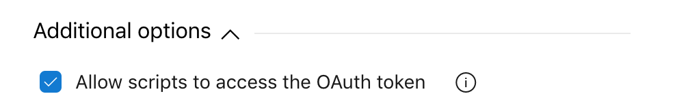

# Get Builds for Triggering Build Branch

This Azure DevOps task gets builds which were built from the same branch as the triggering build's branch.

The primary purpose of the task is to get the latest builds from a feature branch for a triggering build, falling back to develop where a triggering build cannot be located (to be used in conjunction with 'Cancel Build for CI Trigger' task).

Build IDs found by the task are exposed as variables in the format, `Release.Artifacts.${Alias}.KiloudeBuildId`.

Please note that the task assumes the triggering source is following the Gitflow workflow.

## Requirements

The task requires access to the OAuth token.

### OAuth

The task requires access to the OAuth token in order to fetch the build's path filters.

Edit the build and select the 'Agent job'. Under 'Additional Options' select 'Allow scripts to access the OAuth token'.

## License

MIT

## Acknowledgments

* Icon by Smashicons licensed under CC 3.0 BY